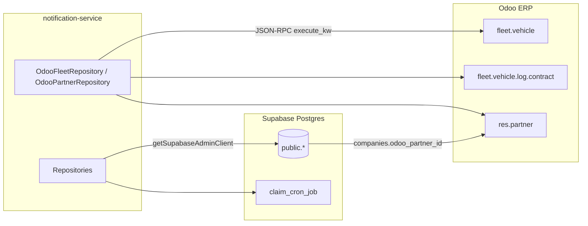

# Supabase & Odoo — Data Layer Reference

Use this skill **before** writing queries. Source of truth for types:

| Layer | Canonical types | Schema SQL |
|-------|-----------------|------------|
| Supabase | `src/types/supabase/database.types.ts` | `src/persistence/supabase/migrations/*.sql` |
| Odoo | `src/types/odoo/**/*.ts` | Odoo UI / model technical names in repos |

`src/persistence/supabase/shema.sql` is a **partial snapshot** (auth/RBAC only). For cron, WhatsApp, and templates use migrations + `database.types.ts`.

## Architecture



**Bridge:** `companies.odoo_partner_id` ↔ Odoo `res.partner.id`. Fleet queries filter by `driver_id` or `purchaser_id` = partner id.

---

## Supabase

### Client & env

- **Server/admin client:** `getSupabaseAdminClient()` from `src/db/supabase/admin.ts`
- Typed as `SupabaseClient<Database>` — bypasses RLS (service role)
- Env: `SUPABASE_URL`, `SUPABASE_SECRET_KEY` (see `src/config/env.ts`)

### Type aliases

Import from `@/types/supabase/index.js`:

```ts
import type { CompanyRow, CronJobRow, NotificationTemplateRow } from '@/types/supabase/index.js';
```

Row/Insert/Update aliases live in `src/types/supabase/tables.ts`.

### Repository pattern

- Location: `src/persistence/repositories/`
- Inject `SupabaseAdminClient` (default: singleton admin client)
- Errors: wrap PostgREST errors in `RepositoryError`
- Interfaces: `ReadRepository`, `WriteRepository` in `base.repository.ts`

```ts
const { data, error } = await this.client
  .from('companies')
  .select('*')
  .eq('odoo_partner_id', partnerId)
  .maybeSingle();

if (error) throw new RepositoryError('...', error);
```

### Tables (public schema)

#### Auth & RBAC

| Table | PK | Key columns | Notes |
|-------|-----|-------------|-------|
| `roles` | `id` uuid | `name`, `slug` unique | Platform roles (admin, cliente) |
| `permissions` | `id` uuid | `name`, `slug` unique | Master permission list |
| `role_permissions` | `(role_id, permission_id)` | FK → roles, permissions | N:M |
| `profiles` | `id` uuid | FK → `auth.users`, `role_id`, `company_id?`, `username`, `phone`, `avatar_url` | One row per auth user |
| `companies` | `id` uuid | `odoo_partner_id` int **unique**, `name` | Links app tenant → Odoo partner |

#### Company membership (multi-tenant)

| Table | PK | Key columns |
|-------|-----|-------------|
| `company_roles` | `id` | `slug` (`company_admin`, `company_employee`) |
| `company_members` | `id` | `company_id`, `profile_id`, `company_role_id`; unique `(profile_id, company_id)` |
| `company_member_permissions` | `(company_member_id, permission_id)` | Per-member grants |
| `company_member_units` | `id` | `company_member_id`, `vin`; unique `(company_member_id, vin)` |

#### Cron scheduler

| Table | PK | Key columns |
|-------|-----|-------------|
| `cron_jobs` | `id` | `key` unique, `provider` (`odoo`\|`supabase`\|`internal`), `task_key`, `schedule`, `timezone`, `enabled`, `config` jsonb, lock fields |
| `cron_job_runs` | `id` | `job_id` FK, `status`, `triggered_by`, `worker_id`, `started_at`, `metadata` jsonb |

RPC: `claim_cron_job(p_job_id, p_worker_id)` → row or null (atomic lock).

#### Notifications

| Table | PK | Key columns |
|-------|-----|-------------|
| `template_classifications` | `id` | `name` unique (`system`, `contracts`) |
| `notification_templates` | `id` | `name`+`channel` unique; `channel` `email`\|`whatsapp`; email needs `html_body`+`default_subject`; WhatsApp needs `content_sid`+`variables` json array |
| `whatsapp_message_context` | `id` | `phone`, `serial_ending`, `template`, `message_sid?`; indexed `(phone, created_at desc)` |

### Common Supabase query patterns

**Join profiles → company → odoo id:**
```sql
select p.id, p.phone, c.odoo_partner_id, c.name
from profiles p
left join companies c on c.id = p.company_id
where p.phone = '+52...';
```

**Member VINs for a user in a company:**
```sql
select cmu.vin
from company_members cm
join company_member_units cmu on cmu.company_member_id = cm.id
where cm.profile_id = $1 and cm.company_id = $2;
```

**Active notification template:**
```ts
.from('notification_templates')
.select('*, template_classifications(name)')
.eq('name', 'crash-alert')
.eq('channel', 'email')
.eq('is_active', true)
.single();
```

**Latest WhatsApp context by phone:** see `WhatsAppContextRepository.findLatestByPhone`.

### Existing repositories

| Repository | Table(s) | File |
|------------|----------|------|
| `CompaniesRepository` | `companies` | `companies.repository.ts` |
| `CompanyMembersRepository` | `company_members`, `company_member_units`, joins | `company-members.repository.ts` |
| `CronJobRepository` | `cron_jobs`, `cron_job_runs` | `cron-job.repository.ts` |
| `WhatsAppContextRepository` | `whatsapp_message_context` | `whatsapp-context.repository.ts` |
| `TemplateClassificationRepository` | `template_classifications` | `template-classification.repository.ts` |
| `NotificationTemplateRepository` | `notification_templates` | `notification-template.repository.ts` |

---

## Odoo

### Client & env

- **Client:** `getOdooClient()` / `odooCall()` from `src/db/odoo/odoo.ts`
- JSON-RPC POST `{ODOO_URL}/jsonrpc` → `object.execute_kw`
- Env: `ODOO_URL`, `ODOO_DB`, `ODOO_USER`, `ODOO_PASSWORD` (API key if SSO)

```ts
import { odooCall } from '@/db/odoo/odoo.js';

const rows = await odooCall<OdooFleetVehicle[]>(
  'fleet.vehicle',
  'search_read',
  [[['driver_id', '=', odooPartnerId]]],
  { fields: ['name', 'vin_sn'], limit: 100 }
);
```

### Odoo field types (TypeScript)

From `src/types/odoo/common.ts`:

| Odoo | TS type | Helper |
|------|---------|--------|
| Many2one | `[number, string] \| false \| null` | `many2one()` in `src/db/odoo/utils.ts` |
| Char empty | `string \| false \| null` | `odooScalar()` |

Always request explicit `fields` in `search_read` — unspecified fields are not returned.

### Models in use

#### `res.partner` → `OdooPartner`

Repo: `src/db/odoo/partners/partners.ts`

Default domain: `[['customer_rank', '>', 0]]`

| Field | Type | Notes |
|-------|------|-------|
| `id` | number | PK; matches `companies.odoo_partner_id` |
| `name`, `email`, `phone`, `mobile` | string/false | |
| `is_company` | boolean | |
| `customer_rank`, `supplier_rank` | number | |
| `parent_id`, `company_id`, `state_id`, `country_id` | m2o | |

#### `fleet.vehicle` → `OdooFleetVehicle`

Repo: `src/db/odoo/fleet/fleet.ts` — `getVehicles({ odooPartnerId? })`

Filter: `driver_id = odooPartnerId` when option set.

| Field | Notes |
|-------|-------|
| `vin_sn` | Full VIN/chassis |
| `license_plate`, `name` | Display |
| `driver_id` | m2o → `res.partner` |
| `x_studio_nombre_del_usuario` | Custom studio field |

#### `fleet.vehicle.log.contract` → `OdooFleetVehicleLogContract`

| Method | Domain | Use |
|--------|--------|-----|
| `getContractVehiclesByVinSn(vin)` | `x_studio_numero_de_chasis_de_la_unidad = vin` | WhatsApp REVISAR flow |
| `getContractVehiclesStats({ odooPartnerId? })` | optional `purchaser_id = partner` | Stats / notifications |
| `getExpiringContracts()` | `active` + `open`, filter `days_left` ∈ {30, 1, ≤0} | Notification cron handlers |

Key fields: `vehicle_id`, `cost_subtype_id`, `state`, `start_date`, `expiration_date`, `days_left`, `expires_today`, `purchaser_id`, `x_studio_numero_de_chasis_de_la_unidad`.

`OdooFleetVehicleLogContractExpiring` (notification cron): picks `cost_subtype_id`, `expiration_date`, `vehicle_id`, `purchaser_id`, `x_studio_numero_de_chasis_de_la_unidad`, `days_left`.

### Odoo domain syntax (for new queries)

```python
# AND (default): all conditions in one list
[['field', '=', value], ['field2', '>', 0]]

# OR: prefix tuple
['|', ['a', '=', 1], ['b', '=', 2]]

# IN
[['id', 'in', [1, 2, 3]]]

# LIKE (case-sensitive in Odoo)
[['name', 'ilike', 'acme']]
```

`search_read` signature: `args = [domain]`, `kwargs = { fields, limit, offset, order }`.

### Cross-system flow (example)

WhatsApp `REVISAR` (`contract-review.service.ts`):

1. Supabase: `whatsapp_message_context` by `phone` → `serial_ending`
2. Odoo: `fleet.vehicle.log.contract` where `x_studio_numero_de_chasis_de_la_unidad = serial_ending`

---

## Workflow: add or change a query

1. **Identify store** — Postgres (Supabase) vs Odoo model.
2. **Read types** — `database.types.ts` or `src/types/odoo/...` before writing SQL/domains.
3. **Prefer repository** — extend existing repo or add `src/persistence/repositories/<name>.repository.ts` for Supabase; `src/db/odoo/<domain>/` for Odoo.
4. **Supabase migration** — new table/column → `src/persistence/supabase/migrations/` then regenerate/update `database.types.ts` and `tables.ts` aliases.
5. **Odoo types** — add interface under `src/types/odoo/` matching `fields` requested in `search_read`.
6. **Never** use user-scoped Supabase client for backend jobs — use admin client.

---

## Quick type imports

```ts
// Supabase
import type { Database, Json, CompanyRow, CronJobRow } from '@/types/supabase/index.js';

// Odoo
import type { OdooPartner } from '@/types/odoo/partners/partner.js';
import type { OdooFleetVehicle } from '@/types/odoo/fleets/vehicle/vehicle.js';
import type { OdooFleetVehicleLogContract } from '@/types/odoo/fleets/log.contract/log.contract.js';
import { many2one, odooScalar } from '@/db/odoo/utils.js';
```

For full column-level Row definitions, open `schemas.md` in this skill folder or `database.types.ts` directly.
