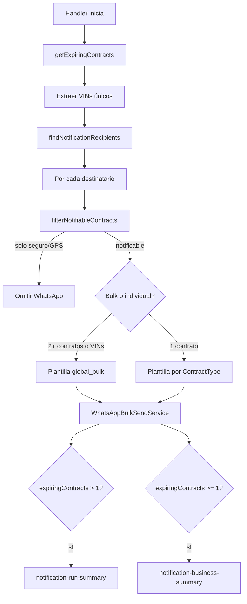

# Notificaciones de contratos por vencer

Guía del flujo de cron jobs que consulta contratos en Odoo, notifica operadores por WhatsApp y envía correos de resumen internos.

## Handlers registrados

| `task_key` | Archivo | Uso |
|------------|---------|-----|
| `internal.notification` | `src/jobs/handlers/notification-handler.ts` | Notificación principal (universo 30 días / 1 día / vencidos) |
| `internal.notification-recurrent` | `src/jobs/handlers/notification-recurrent.ts` | Misma lógica para contratos recurrentes |

## Flujo de ejecución



## Universo de contratos (Odoo)

`OdooFleetRepository.getExpiringContracts()` consulta contratos `active` + `open` y filtra en memoria por `days_left`:

| `days_left` | Universo |
|-------------|----------|
| `30` | 30 días antes |
| `1` | 1 día antes |
| `<= 0` | Vencidos |

Campos relevantes: `cost_subtype_id`, `expiration_date`, `vehicle_id`, `purchaser_id`, `x_studio_numero_de_chasis_de_la_unidad`, `days_left`.

El **cliente** en avisos LMM internos viene de `purchaser_id[1]` (Odoo). El nombre del operador en WhatsApp viene de la plataforma (`company_members`).

## Destinatarios WhatsApp

`companyMembersRepository.findNotificationRecipients(expiringVins)`:

- Filtra miembros con VINs en `company_member_units` que coincidan con contratos por vencer.
- `company_admin` recibe sus VINs más los de empleados de la misma empresa.
- Se une `company_roles.slug` para permisos de alcance.

### Tipos excluidos de WhatsApp

**Póliza de seguro** y **Gps** no reciben mensaje (ni bulk ni individual). Se omiten con `filterNotifiableContracts()` y se cuentan en `skipped_excluded_contract_types`.

El correo de negocio **sí** incluye todos los tipos (incl. seguro y GPS).

## Plantillas WhatsApp

| Escenario | Plantilla | Variables |
|-----------|-----------|-----------|
| 2+ contratos o 2+ VINs | `global_bulk` (`bulk=true`) | `name`, `count`, `serial_list`, `contract_list`, `phone_number` |
| 1 contrato | Por `ContractType` + `days_left` | Ver `resolveTemplateVars.ts` |

`ContractType` (etiquetas Odoo): Servicio automotriz, Tenencia anual, Verificación vehicular, Leasing, Tarjeta de circulación, etc.

## Correos de resumen

Se envían automáticamente al final del handler. Destinatarios: `CRASH_ALERT_EMAIL` + `BUSINESS_SUMMARY_EMAIL` (deduplicados).

### 1. Resumen operativo (`notification-run-summary`)

- **Cuándo:** `expiringContracts.length > 1`
- **Migración:** `20260708000001_notification_run_summary_email.sql`
- **Builder:** `src/jobs/utils/buildNotificationSummary.ts`
- **Servicio:** `src/notifications/notification-summary.service.ts`
- **Contenido:** métricas WhatsApp, contratos por tipo, VINs sin operador, mensajes encolados

### 2. Resumen de negocio LMM (`notification-business-summary`)

- **Cuándo:** `expiringContracts.length >= 1`
- **Migración:** `20260709000001_business_notification_summary_email.sql`
- **Builder:** `src/jobs/utils/buildBusinessNotificationSummary.ts`
- **Mensajes:** `src/jobs/utils/buildBusinessNotificationMessages.ts` (formato `lmm.txt`, singular/plural)
- **Servicio:** `src/notifications/business-notification-summary.service.ts`
- **Diseño:** React Email en `leasing-m/emails/NotificationBusinessSummary.tsx` → exportar con `pnpm emails:export`

Secciones del correo:

| Variable | Contenido |
|----------|-----------|
| `totalsHtml` | Totales por universo (30 días, 1 día, vencidos) y registro en plataforma |
| `thirtyDayMessagesHtml` / `thirtyDayTableHtml` | Avisos internos + tabla (Tipo, Unidad, VIN, Expiración, En plataforma) |
| `oneDayMessagesHtml` / `oneDayTableHtml` | Igual para 1 día |
| `expiredMessagesHtml` / `expiredTableHtml` | Igual para vencidos |

**En plataforma** = VIN presente en algún `recipient.vins` de `findNotificationRecipients`.

### Actualizar diseño del correo de negocio

1. Editar `leasing-m/emails/NotificationBusinessSummary.tsx`
2. Ejecutar en leasing-m: `pnpm emails:export`
3. Copiar `emails/NotificationBusinessSummary.html` al `html_body` de la migración o actualizar vía `PATCH /notification-templates`

## Variables de entorno

```env
CRASH_ALERT_EMAIL=ops@example.com,devops@example.com
BUSINESS_SUMMARY_EMAIL=negocio@example.com
CONTACT_NUMBER=+52...
EMAIL_CONTACT_NUMBER=+52...
```

| Variable | Uso |
|----------|-----|
| `CRASH_ALERT_EMAIL` | Crash alerts + resúmenes (operativo y negocio) |
| `BUSINESS_SUMMARY_EMAIL` | Destinatarios adicionales solo para resúmenes (se fusionan con crash alert) |
| `CONTACT_NUMBER` | Número en plantillas WhatsApp |
| `EMAIL_CONTACT_NUMBER` | Número en plantillas email de contratos |

## Metadata de ejecución (`cron_job_runs`)

```json
{
  "recipients_count": 45,
  "whatsapp_total": 38,
  "whatsapp_succeeded": 37,
  "whatsapp_failed": 1,
  "skipped_without_phone": 2,
  "skipped_without_contract": 1,
  "skipped_excluded_contract_types": 4,
  "skipped_without_template": 0,
  "skipped_without_expiration_date": 0,
  "summary_email_sent": true,
  "business_summary_email_sent": true
}
```

## Archivos clave

| Área | Ruta |
|------|------|
| Handler principal | `src/jobs/handlers/notification-handler.ts` |
| Handler recurrente | `src/jobs/handlers/notification-recurrent.ts` |
| Odoo contratos | `src/db/odoo/fleet/fleet.ts` |
| Destinatarios | `src/persistence/repositories/company-members.repository.ts` |
| Bulk / exclusión tipos | `src/jobs/utils/formatBulkNotification.ts` |
| Mensajes LMM | `src/jobs/utils/buildBusinessNotificationMessages.ts` |
| Copy negocio | `lmm.txt` (referencia de redacción) |

## Crear el cron job

```bash
curl -sS -X POST "$API_BASE/cron-jobs" \
  -H "content-type: application/json" \
  -H "x-api-key: $SERVICE_API_KEY" \
  -d '{
    "key": "internal.notification.daily",
    "name": "Notificaciones contratos por vencer",
    "description": "WhatsApp a operadores + correos de resumen operativo y LMM.",
    "provider": "internal",
    "task_key": "internal.notification",
    "schedule": "0 8 * * *",
    "timezone": "America/Mexico_City",
    "enabled": true,
    "no_overlap": true,
    "max_runtime_seconds": 900,
    "config": {}
  }'
```

Ver también [Cron jobs](../src/jobs/README.md) y [Plantillas de email](./plantillas/email.md).
