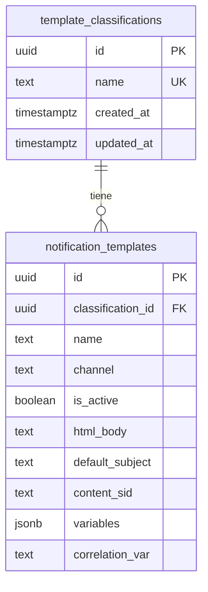

# Plantillas de notificación

Este módulo centraliza las plantillas de **email** y **WhatsApp** en Supabase. El campo `template` en `POST /notifications` es el identificador (`name`) de la plantilla registrada en base de datos.

## Modelo de datos



### Reglas importantes

- **`name` + `channel`** es único: el mismo nombre puede existir en email y en WhatsApp, pero no dos veces en el mismo canal.
- **`name`** debe ser kebab-case: `crash-alert`, `contract-status-review`.
- Toda plantilla requiere una **clasificación** (`classification_id`).
- Solo las plantillas con `is_active: true` pueden usarse en envíos.

### Campos por canal

| Campo | Email | WhatsApp |
|-------|:-----:|:--------:|
| `html_body` | Requerido | — |
| `default_subject` | Requerido | — |
| `content_sid` | — | Requerido (`HX...`) |
| `variables` | — | Requerido (array ordenado) |
| `correlation_var` | — | Opcional (debe estar en `variables`) |

## Flujo general de alta

```
1. Crear clasificación (si no existe)
        ↓
2. Crear plantilla en POST /notification-templates
        ↓
3. (WhatsApp) Aprobar plantilla en Twilio y registrar content_sid
        ↓
4. Probar envío con POST /notifications o POST /notifications/whatsapp/bulk (lotes)
```

## Guías detalladas

1. [Clasificaciones](./clasificaciones.md) — paso a paso del catálogo
2. [Email](./email.md) — alta y envío de plantillas email
3. [WhatsApp](./whatsapp.md) — alta en Twilio, registro en DB y envío

## Plantillas incluidas en migraciones

Tras aplicar las migraciones de plantillas:

| name | channel | clasificación | Migración | Notas |
|------|---------|---------------|-----------|-------|
| `crash-alert` | email | `system` | `20260701000001_...` | Alertas de crash del servicio |
| `notification-run-summary` | email | `contracts` | `20260708000001_...` | Resumen operativo del cron (métricas WhatsApp) |
| `notification-business-summary` | email | `contracts` | `20260709000001_...` | Resumen LMM interno (avisos + tablas por universo) |
| `contract-status-review` | whatsapp | `contracts` | `20260701000001_...` | Requiere actualizar `content_sid` con el HX real de Twilio |

El HTML de `notification-business-summary` se genera desde el repo **leasing-m** (`emails/NotificationBusinessSummary.tsx`) con `pnpm emails:export`. Ver [notificaciones-contratos.md](../notificaciones-contratos.md).

## Consultar plantillas existentes

```bash
# Todas las plantillas email
curl -sS "$API_BASE/notification-templates?channel=email" \
  -H "x-api-key: $SERVICE_API_KEY" | jq

# Todas las plantillas WhatsApp activas
curl -sS "$API_BASE/notification-templates?channel=whatsapp&isActive=true" \
  -H "x-api-key: $SERVICE_API_KEY" | jq

# Clasificaciones
curl -sS "$API_BASE/template-classifications" \
  -H "x-api-key: $SERVICE_API_KEY" | jq
```
