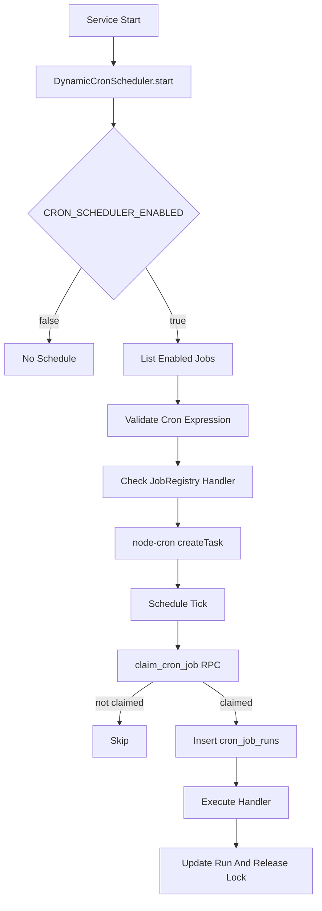

# Cronjobs Dinamicos

Esta carpeta contiene el runtime de cronjobs dinamicos del servicio. La configuracion vive en Supabase y el codigo que se ejecuta vive en TypeScript dentro del backend.

## Resumen

El scheduler se inicia desde `src/index.ts` cuando arranca el servidor:

```ts
const scheduler = getDynamicCronScheduler();
await scheduler.start();
```

Si `CRON_SCHEDULER_ENABLED=false`, el scheduler no consulta Supabase ni programa jobs. Este valor esta apagado por defecto para permitir desplegar el servicio antes de aplicar la migracion de `cron_jobs`.

## Piezas Principales

```text
src/jobs/
├── create-job-scheduler.ts      # Ensambla repository, registry, runner y scheduler
├── cron-job.service.ts          # Reglas de negocio y CRUD administrativo
├── dynamic-cron-scheduler.ts    # Lee jobs activos y los agenda con node-cron
├── job-registry.ts              # Lista segura de handlers permitidos
├── job-runner.ts                # Toma lock, ejecuta handler y audita el resultado
├── worker-id.ts                 # Identificador unico por proceso
├── handlers/                    # Handlers por dominio
└── README.md                    # Esta guia
```

Tambien participan:

- `src/http/routes/cron-job.routes.ts`: API HTTP para administrar jobs sin tocar Supabase directamente.
- `src/persistence/repositories/cron-job.repository.ts`: acceso a `cron_jobs`, `cron_job_runs` y RPC `claim_cron_job`.
- `src/persistence/supabase/migrations/20260526000001_create_dynamic_cron_jobs.sql`: tablas, indices, constraints y funcion atomica de lock.
- `src/types/jobs/cron-job.ts`: tipos del contexto que recibe cada handler.

## Flujo De Ejecucion



## Tablas

### `cron_jobs`

Guarda la configuracion declarativa del job.

Campos importantes:

- `key`: identificador unico legible, por ejemplo `odoo.sync_fleet_vehicles`.
- `name`: nombre para humanos.
- `description`: descripcion del objetivo del job.
- `provider`: origen o contexto del job. Valores permitidos: `odoo`, `supabase`, `internal`.
- `task_key`: clave del handler registrado en `JobRegistry`.
- `schedule`: expresion cron que usa `node-cron`.
- `timezone`: zona horaria del cron, por ejemplo `UTC` o `America/Mexico_City`.
- `enabled`: si esta en `true`, el scheduler lo programa.
- `no_overlap`: evita traslapes dentro del mismo proceso de Node.
- `max_runtime_seconds`: tiempo maximo del lease y timeout del handler.
- `config`: JSON libre para parametros del handler.
- `lock_owner` y `locked_until`: lease multi-instancia.
- `last_status`, `last_error`, `last_run_at`: ultimo estado operativo.

### `cron_job_runs`

Guarda una fila por ejecucion reclamada.

Estados:

- `running`
- `success`
- `failed`
- `skipped`
- `timeout`

`triggered_by` puede ser `schedule`, `manual`, `startup` o `system`.

## Como Se Evita La Doble Ejecucion

Hay dos niveles de proteccion:

1. `node-cron` usa `noOverlap` para evitar que el mismo proceso ejecute dos veces el mismo job si una ejecucion sigue viva.
2. Supabase/Postgres usa `claim_cron_job(job_id, worker_id)` para tomar un lease atomico entre multiples instancias del servicio.

El lock real para multiples instancias esta en Supabase:

```sql
update public.cron_jobs
set
  lock_owner = p_worker_id,
  locked_until = now() + make_interval(secs => max_runtime_seconds),
  last_status = 'running',
  last_error = null
where id = p_job_id
  and enabled = true
  and (locked_until is null or locked_until < now())
returning *;
```

Si otra instancia ya tomo el job, `claim_cron_job` no devuelve fila y el runner responde `skipped`.

## Como Crear Un Job

Crear un cronjob requiere dos cosas:

1. Escribir y registrar el handler TypeScript.
2. Crear la fila en `cron_jobs` con el mismo `task_key` (via API o SQL).

### 1. Escribir El Codigo Del Job

El codigo que se ejecuta debe vivir en el backend. La recomendacion es crear handlers bajo `src/jobs/handlers/`.

Ejemplo:

```ts
// src/jobs/handlers/sync-fleet-vehicles.ts
import type { CronJobHandler } from '@/types/jobs/index.js';
import { OdooFleetRepository } from '@/db/odoo/fleet/fleet.js';

export const syncFleetVehiclesJob: CronJobHandler = async ({ config, signal }) => {
  if (signal.aborted) return;

  const fleetRepository = new OdooFleetRepository();
  const options =
    typeof config === 'object' && config && !Array.isArray(config)
      ? { odooPartnerId: Number(config.odoo_partner_id) || undefined }
      : undefined;

  const vehicles = await fleetRepository.getVehicles(options);

  return {
    metadata: {
      vehicles_count: vehicles.length,
    },
  };
};
```

El handler recibe:

- `job`: fila completa de `cron_jobs`.
- `config`: JSON de configuracion del job.
- `runId`: id de la fila en `cron_job_runs`.
- `workerId`: instancia que tomo el lock.
- `triggeredBy`: origen de la ejecucion.
- `signal`: `AbortSignal` que se aborta si el job excede `max_runtime_seconds`.

### 2. Registrar El Handler

Agregar el handler al registry en `src/jobs/job-registry.ts`:

```ts
import { syncFleetVehiclesJob } from '@/jobs/handlers/sync-fleet-vehicles.js';

export function createDefaultJobRegistry(): JobRegistry {
  const registry = new JobRegistry();

  registry.register('internal.noop', async () => ({
    metadata: {
      message: 'No-op job executed successfully',
    },
  }));

  registry.register('odoo.sync_fleet_vehicles', syncFleetVehiclesJob);

  return registry;
}
```

El valor usado en `registry.register(...)` debe coincidir exactamente con `cron_jobs.task_key`.

## API HTTP De Administracion

Todas las rutas requieren el header `x-api-key` con el valor de `SERVICE_API_KEY`.

| Metodo | Ruta | Descripcion |
|--------|------|-------------|
| `GET` | `/cron-jobs?limit=20&offset=0&enabled=true` | Listar jobs paginados |
| `GET` | `/cron-jobs/:id` | Detalle por UUID |
| `POST` | `/cron-jobs` | Crear job |
| `PATCH` | `/cron-jobs/:id` | Editar job |
| `DELETE` | `/cron-jobs/:id` | Eliminar job |
| `POST` | `/cron-jobs/:id/pause` | Pausar (`enabled=false`) |
| `POST` | `/cron-jobs/:id/resume` | Reanudar (`enabled=true`) |
| `POST` | `/cron-jobs/:id/run` | Ejecutar manualmente |
| `GET` | `/cron-jobs/:id/runs?limit=20&offset=0` | Historial de ejecuciones |

`limit` por defecto es `20`, maximo `100`. `offset` por defecto es `0`.

Tras crear, editar, eliminar, pausar o reanudar, el servicio intenta reconciliar el scheduler de inmediato (sin bloquear la respuesta HTTP si falla).

### Crear Un Job Por API

```bash
curl -sS -X POST http://localhost:3000/cron-jobs \
  -H "content-type: application/json" \
  -H "x-api-key: $SERVICE_API_KEY" \
  -d '{
    "key": "internal.notification.test.every_minute",
    "name": "Notification test",
    "description": "Job de prueba para validar scheduler y auditoria.",
    "provider": "internal",
    "task_key": "internal.notification.test",
    "schedule": "*/1 * * * *",
    "timezone": "UTC",
    "enabled": true,
    "no_overlap": true,
    "max_runtime_seconds": 60,
    "config": { "note": "hello" }
  }'
```

### Listar Jobs

```bash
curl -sS "http://localhost:3000/cron-jobs?limit=10&offset=0" \
  -H "x-api-key: $SERVICE_API_KEY"
```

Respuesta:

```json
{
  "code": "CRON_JOBS_LISTED",
  "success": true,
  "data": {
    "items": [],
    "pagination": { "limit": 10, "offset": 0, "total": 0 }
  }
}
```

### Pausar Y Reanudar

```bash
curl -sS -X POST "http://localhost:3000/cron-jobs/<job-id>/pause" \
  -H "x-api-key: $SERVICE_API_KEY"

curl -sS -X POST "http://localhost:3000/cron-jobs/<job-id>/resume" \
  -H "x-api-key: $SERVICE_API_KEY"
```

### Editar Schedule U Otros Campos

```bash
curl -sS -X PATCH "http://localhost:3000/cron-jobs/<job-id>" \
  -H "content-type: application/json" \
  -H "x-api-key: $SERVICE_API_KEY" \
  -d '{ "schedule": "0 */2 * * *" }'
```

El scheduler compara una huella de la configuracion (`schedule`, `timezone`, `config`, `updated_at`, etc.). Si cambia, destruye la tarea anterior y crea una nueva.

### Ejecutar Manualmente

```bash
curl -sS -X POST "http://localhost:3000/cron-jobs/<job-id>/run" \
  -H "x-api-key: $SERVICE_API_KEY"
```

El job manual pasa por el mismo lock multi-instancia y crea fila en `cron_job_runs` con `triggered_by=manual`. Si el job esta pausado (`enabled=false`) o ya esta bloqueado, la API responde `409` con codigo `CRON_JOB_RUN_SKIPPED`.

### Consultar Historial De Ejecuciones

```bash
curl -sS "http://localhost:3000/cron-jobs/<job-id>/runs?limit=20&offset=0" \
  -H "x-api-key: $SERVICE_API_KEY"
```

### Eliminar Un Job

```bash
curl -sS -X DELETE "http://localhost:3000/cron-jobs/<job-id>" \
  -H "x-api-key: $SERVICE_API_KEY"
```

## Configuracion En Supabase (Referencia Avanzada)

Primero aplica la migracion:

```bash
supabase db push
```

O ejecuta el SQL de `src/persistence/supabase/migrations/20260526000001_create_dynamic_cron_jobs.sql` desde el SQL editor de Supabase.

Ejemplo de insercion directa (solo si no usas el API):

```sql
insert into public.cron_jobs (
  key,
  name,
  description,
  provider,
  task_key,
  schedule,
  timezone,
  enabled,
  no_overlap,
  max_runtime_seconds,
  config
) values (
  'odoo.sync_fleet_vehicles',
  'Sincronizar vehiculos de Odoo',
  'Extrae vehiculos desde Odoo Fleet para procesamiento interno.',
  'odoo',
  'odoo.sync_fleet_vehicles',
  '*/15 * * * *',
  'America/Mexico_City',
  true,
  true,
  900,
  '{"odoo_partner_id": 123}'::jsonb
);
```

## Como Correr Los Jobs

### Correrlos Por Schedule

1. Aplicar la migracion de Supabase.
2. Crear filas en `cron_jobs` con `enabled=true`.
3. Activar el scheduler:

```env
CRON_SCHEDULER_ENABLED=true
CRON_SCHEDULER_RELOAD_INTERVAL_MS=60000
```

4. Arrancar el servicio:

```bash
pnpm dev
```

El scheduler carga los jobs habilitados al arrancar y vuelve a sincronizar la configuracion cada `CRON_SCHEDULER_RELOAD_INTERVAL_MS`. Tambien puedes usar el API de administracion descrito arriba para pausar, reanudar o editar jobs sin SQL.

### Ejecutar Un Job Manualmente Desde Codigo Interno

Si necesitas dispararlo desde codigo interno (sin HTTP), usa `JobRunner` con `triggeredBy='manual'`:

```ts
import { createCronJobRuntime } from '@/jobs/create-job-scheduler.js';

const { repository, runner } = createCronJobRuntime();
const job = await repository.findByKey('odoo.sync_fleet_vehicles');
if (!job) throw new Error('Job not found');

await runner.run(job.id, 'manual');
```

## Ejemplo De Job De Prueba

Handlers listos para pruebas:

```text
task_key = internal.noop
task_key = internal.notification.test
```

Crear por API:

```bash
curl -sS -X POST http://localhost:3000/cron-jobs \
  -H "content-type: application/json" \
  -H "x-api-key: $SERVICE_API_KEY" \
  -d '{
    "key": "internal.noop.every_minute",
    "name": "No-op cada minuto",
    "description": "Job de prueba para validar scheduler, locks y auditoria.",
    "provider": "internal",
    "task_key": "internal.noop",
    "schedule": "* * * * *",
    "timezone": "UTC",
    "enabled": true,
    "no_overlap": true,
    "max_runtime_seconds": 60,
    "config": {}
  }'
```

Revisar ejecuciones por API:

```bash
curl -sS "http://localhost:3000/cron-jobs/<job-id>/runs?limit=20&offset=0" \
  -H "x-api-key: $SERVICE_API_KEY"
```

Consulta SQL equivalente (referencia):

```sql
select
  j.key,
  r.status,
  r.triggered_by,
  r.worker_id,
  r.started_at,
  r.finished_at,
  r.duration_ms,
  r.error_message,
  r.metadata
from public.cron_job_runs r
join public.cron_jobs j on j.id = r.job_id
order by r.started_at desc
limit 20;
```

## Reglas Para Nuevos Jobs

- No guardar secretos en `config`; usa variables de entorno o un vault.
- No ejecutar codigo arbitrario desde la base de datos; la DB solo decide `task_key`, el registry decide que handlers existen.
- Hacer jobs idempotentes. Si una ejecucion se repite por retry operacional, no debe duplicar efectos irreversibles.
- Respetar `signal.aborted` en loops o procesos largos.
- Escribir metadata util en el resultado: contadores, ids procesados, cursor usado, etc.
- Mantener `max_runtime_seconds` realista. Tambien define cuanto tiempo dura el lease.
- Para jobs Odoo, leer desde `src/db/odoo/*` y persistir con repositorios de `src/persistence/repositories/*`.

## Troubleshooting

- El job no corre:
  - Revisa `CRON_SCHEDULER_ENABLED=true`.
  - Revisa que `enabled=true` en `cron_jobs`.
  - Revisa que `schedule` sea valido.
  - Revisa que `task_key` este registrado en `JobRegistry`.

- Corre en una instancia pero no en otra:
  - Es esperado. Solo una instancia debe adquirir el lease.

- Queda bloqueado:
  - Revisa `locked_until`. Si el proceso murio, otra instancia podra reclamarlo cuando expire.
  - Considera bajar `max_runtime_seconds` si el timeout es demasiado largo.

- Falla inmediatamente:
  - Revisa `cron_job_runs.error_message`.
  - Revisa `cron_jobs.last_error`.
  - Confirma que las migraciones estan aplicadas y que `SUPABASE_SECRET_KEY` es service role.
